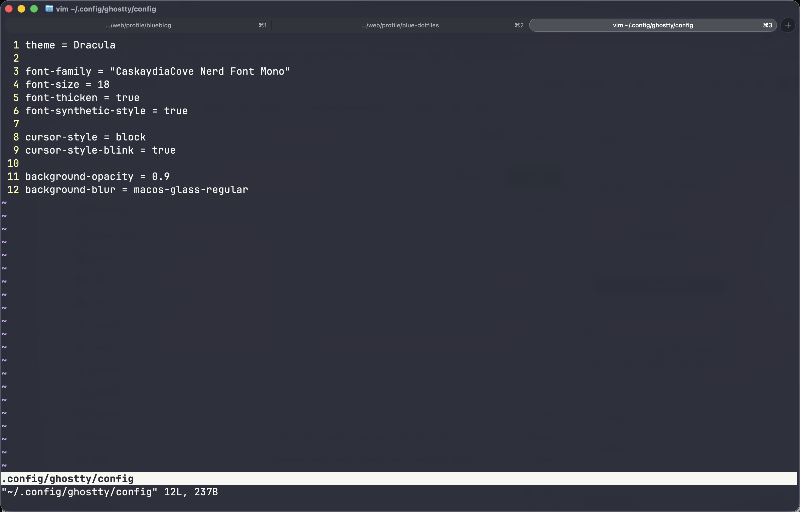
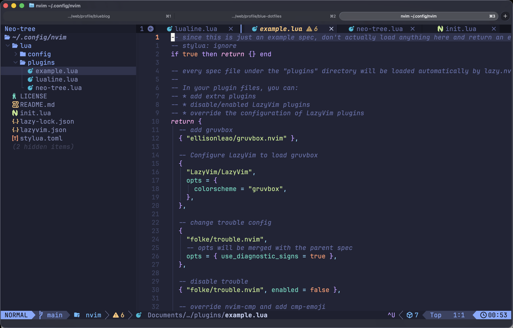
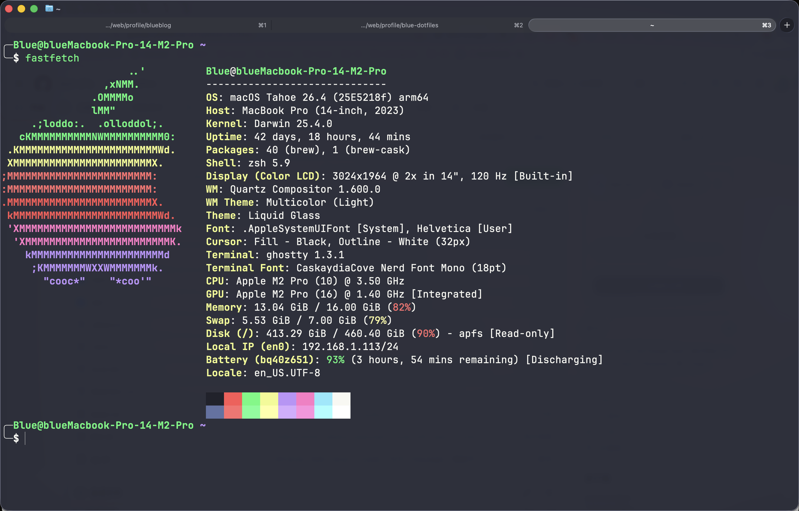
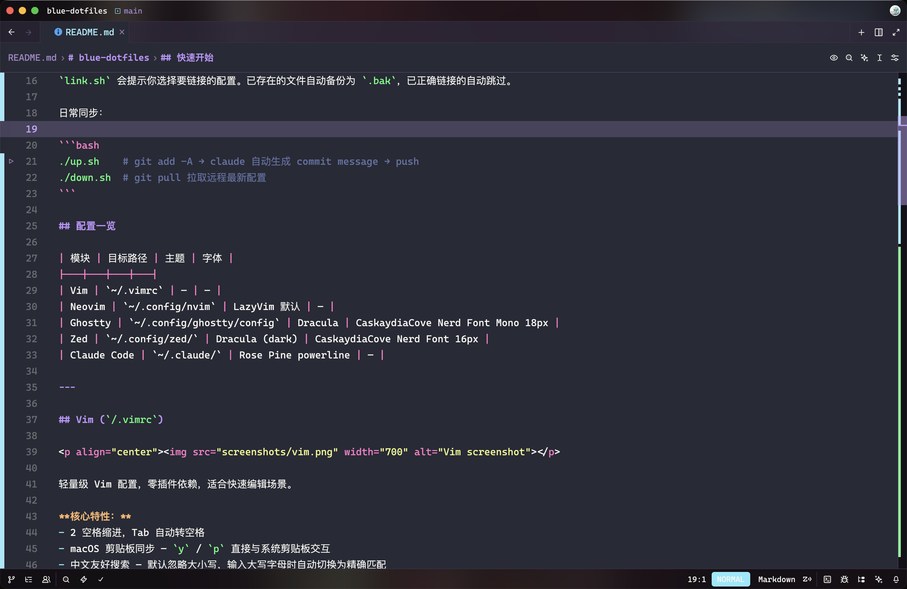
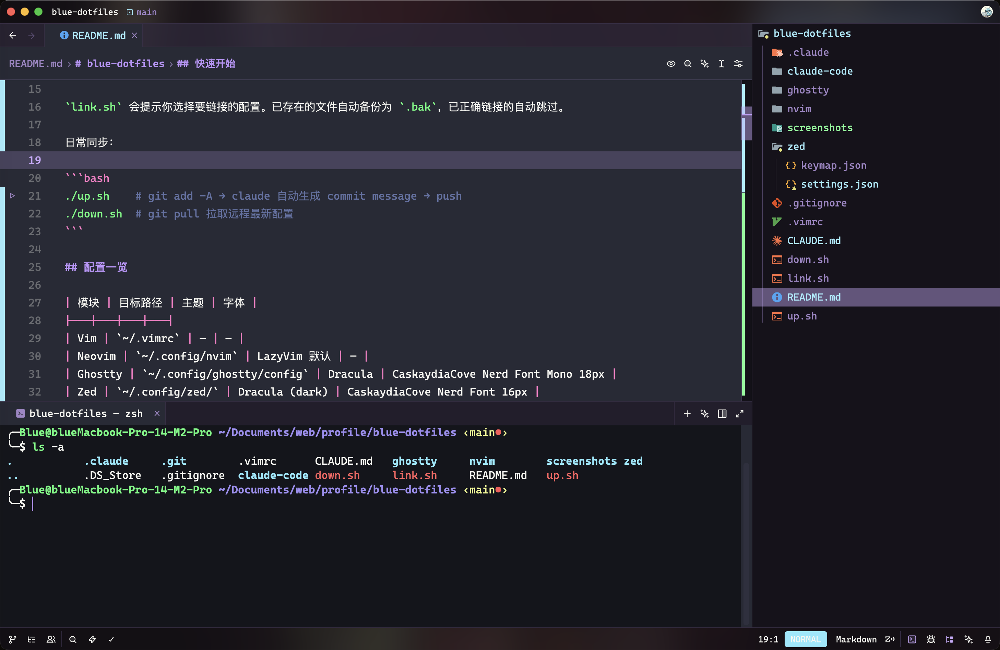
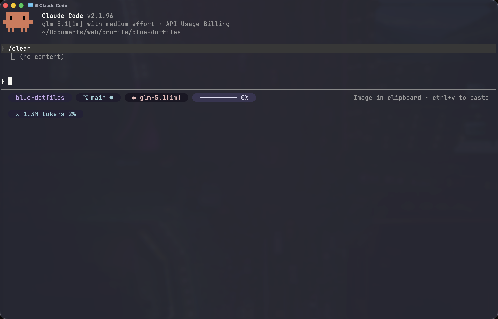

# blue-dotfiles

> [!NOTE]
> Work in progress — 持续迭代中的个人开发环境配置

一套面向 macOS 的终端 / 编辑器 / AI 工具链配置，追求开箱即用、统一美学。

## 快速开始

```bash
git clone https://github.com/user/blue-dotfiles.git
cd blue-dotfiles
./link.sh   # 交互式选择并创建 symlink
```

`link.sh` 会提示你选择要链接的配置。已存在的文件自动备份为 `.bak`，已正确链接的自动跳过。

日常同步：

```bash
./up.sh    # git add -A → claude 自动生成 commit message → push
./down.sh  # git pull 拉取远程最新配置
```

## 配置一览

| 模块 | 目标路径 | 主题 | 字体 |
|---|---|---|---|
| Vim | `~/.vimrc` | — | — |
| Neovim | `~/.config/nvim` | LazyVim 默认 | — |
| Ghostty | `~/.config/ghostty/config` | Dracula | CaskaydiaCove Nerd Font Mono 18px |
| Zed | `~/.config/zed/` | Dracula (dark) | CaskaydiaCove Nerd Font 16px |
| Claude Code | `~/.claude/` | Rose Pine powerline | — |

---

## Vim (`/.vimrc`)

<p align="center"></p>

轻量级 Vim 配置，零插件依赖，适合快速编辑场景。

**核心特性：**
- 2 空格缩进，Tab 自动转空格
- macOS 剪贴板同步 — `y` / `p` 直接与系统剪贴板交互
- 中文友好搜索 — 默认忽略大小写，输入大写字母时自动切换为精确匹配
- 行号显示 + 滚动时保留 8 行上下文视野

**视觉效果：** 语法高亮 + 底部状态栏（始终显示文件信息）

---

## Neovim (`/nvim/`)

<p align="center"></p>

基于 [LazyVim](https://github.com/LazyVim/LazyVim) 框架的完整 IDE 体验。

**目录结构：**
```
nvim/
├── init.lua              # 入口
├── lua/config/
│   ├── lazy.lua          # lazy.nvim 引导
│   ├── options.lua       # 编辑器选项
│   ├── keymaps.lua       # 快捷键
│   └── autocmds.lua      # 自动命令
├── lua/plugins/
│   ├── lualine.lua       # 状态栏
│   └── neo-tree.lua      # 文件树
└── stylua.toml           # Lua 格式化规则
```

**启用的 LazyVim extras：** `neo-tree`（文件浏览器）、`mini-animate`（流畅动画）

---

## Ghostty (`/ghostty/config`)

<p align="center"></p>

终端模拟器配置，追求沉浸感的半透明毛玻璃效果。

**核心特性：**
- **主题：** Dracula 深色配色
- **字体：** CaskaydiaCove Nerd Font Mono 18px（加粗渲染）
- **背景：** 90% 不透明度 + macOS 玻璃模糊（类似 iOS 的磨砂玻璃效果，可透视桌面壁纸）
- **光标：** 闪烁方块

**视觉效果：** 深紫色 Dracula 配色 + 半透明背景 + 毛玻璃模糊，终端窗口与桌面融为一体

---

## Zed (`/zed/`)

<p align="center">
  
  
</p>

高性能 Rust 编辑器，Vim 模式 + AI 助手。

### settings.json

**核心特性：**
- **Vim 模式** — 完整的 Vim 键位支持
- **主题：** Dark 模式使用 Dracula，Light 模式使用 One Light
- **字体：** CaskaydiaCove Nerd Font（UI 17px / 编辑器 16px）
- **图标：** Material Icon Theme
- **AI 助手：** GLM 模型，面板停靠右侧
- **终端：** 独立字体（Propo 变体），光标闪烁，3000 行滚动历史
- **文件树：** 右侧停靠，不自动折叠目录
- **Tab 栏：** 固定标签独占一行，显示 Git 状态和诊断信息

### keymap.json

| 快捷键 | 模式 | 功能 |
|---|---|---|
| `Cmd+S` | Insert | 退出插入模式 + 保存 |
| `Cmd+I` | Normal | 显示代码补全 |
| `Alt+P` | Normal | 显示 Hover 信息 |
| `Alt+Shift+F` | Normal | 格式化代码 |
| `L` | Project Panel | 打开文件 |

---

## Claude Code (`/claude-code/`)

<p align="center"></p>

Anthropic 的 AI 编程助手 CLI 工具配置。

### settings.json

**核心特性：**
- **语言：** 中文界面
- **模型：** `opus[1m]`（Claude Opus，1M 上下文窗口）
- **Effort Level：** medium（平衡速度与质量）
- **自动记忆：** 开启（跨会话记住项目上下文）
- **状态栏：** 使用 `@owloops/claude-powerline` 显示实时信息
- **隐私：** 禁用非必要网络请求（`CLAUDE_CODE_DISABLE_NONESSENTIAL_TRAFFIC`）

### .claude-powerline.json

状态栏主题配置，Rose Pine 配色 + Capsule 胶囊样式。

**显示内容：**
- 当前目录名
- Git 分支状态
- 当前模型名称
- 上下文使用量（百分比圆点）
- Token 消耗进度条

---

## Symlink 映射

| 仓库路径 | 目标路径 |
|---|---|
| `.vimrc` | `~/.vimrc` |
| `ghostty/config` | `~/.config/ghostty/config` |
| `nvim/` | `~/.config/nvim` |
| `zed/settings.json` | `~/.config/zed/settings.json` |
| `zed/keymap.json` | `~/.config/zed/keymap.json` |
| `claude-code/settings.json` | `~/.claude/settings.json` |
| `claude-code/.claude-powerline.json` | `~/.claude/.claude-powerline.json` |

## License

MIT
